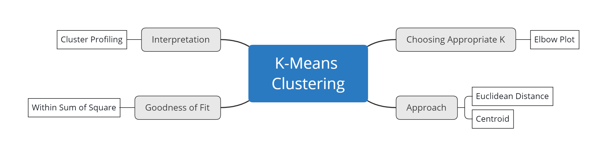

# K-Means Clustering

This repository contains content as a requirement for the R Studio Instructor Certification Exam. The topic to be discussed is about **K-Means Clustering** . I recommend that you have familiarity with R programming and Machine Learning terminology. 

---
