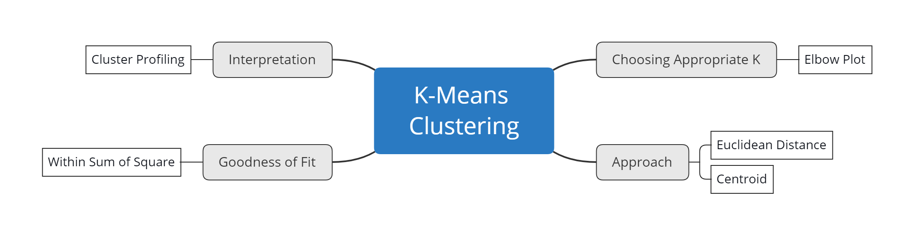
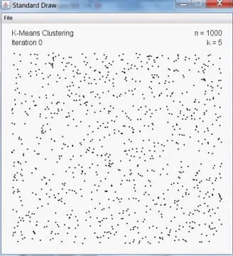

```{r setup, include=FALSE}
knitr::opts_chunk$set(echo = TRUE, message = F, warning = F)
library(tidyverse)
library(factoextra)
library(FactoMineR)
```


# Introduction {.tabset}

## Supervised vs Unsupervised


| | Supervised learning | Unsupervised Learning|
|---|---|---|
|Input data| labelled| Unlabelled|
|Goal | Prediction | Analysis|


## Training Objective




# K-Means Clustering

## How it's works?

<center>



</center>

K-Means algoritm :      
1. Choose number of K     
2. The center of cluster (centroid) will be chosen randomly     
3. Compute distances between each point to each centroid     
4. Assign cluster membership     
5. Update the centroid using means     
6. Back to step no 3     
Do the iteration until there is no change in cluster membership     

## USA Crime Rate Clustering

### Explore the Data

The data to be used is `USArrest` from `datasets` packages. Take a quick look at the datases, which comprise of arrests per 100.000 residents related to one of three crimes in each of the 50 US states in 1973.
```{r}
data("USArrests")
head(USArrests)
```

- `Murder` : murder arrests per 100,000     
- `Assault` : assault arrests per 100,000      
- `UrbanPop` : percent of population in urban areas      
- `Rape` : rape arrests per 100,000     


```{r}
summary(USArrests)
```

The summary result showing that every variable has a different range, because the k-means based on euclidian distance, so we need to scaling the value using `scale` function. 

```{r}
crime_scale <- scale(USArrests)
summary(crime_scale)
```

### Clustering

To find the optimum number of clusters (K) we can use elbow plot method. elbow plot is a technique to choose a point where diminishing returns (wss) are no longer worth the additional cost (number of cluster).

Based on the elbow plot below we will choose K equal to 4 because if we add the K into 5 the total wss not decreasing a lot anymore. 

```{r}
fviz_nbclust(x = crime_scale, FUNcluster = kmeans, "wss")
```


After we know the optimum number of K, now we can create the cluster using `kmeans` function
```{r}
set.seed(100)
usa_kmeans <- kmeans(x = crime_scale, centers = 4)
```

the clustering result can be visualized using plot below
```{r}
fviz_cluster(data = crime_scale,object =  usa_kmeans)
```

to see the characteristics of each cluster, we can see it from the mean of each variable for each cluster.

```{r}
USArrests %>% 
  mutate(cluster = as.factor( usa_kmeans$cluster)) %>% 
  group_by(cluster) %>% 
  summarise_all(mean) %>% 
  pivot_longer(cols = -cluster, names_to = "case") %>% 
  ggplot(aes(x = cluster, y = value, fill = cluster)) +
  geom_col() +
  # geom_text(aes(label = round(value,1) )) +
  facet_wrap(~case, scales = "free") +
  theme_minimal()
```


# Quiz
1. Which of the following is **Not True** about K-Means?     
  A. Centroid in the first iteration is chosen randomly.        
  B. The greater the value of wss (within sum of square), the better the resulting cluster.          
  C. Clustering proses will stop when there is no change in cluster membership.         


2. Please sort the process of making the right cluster         
  A. Create Cluster     
  B. Scaling     
  C. Read Data     
  D. Cluster Profiling     
  E. Elbow Plot     

